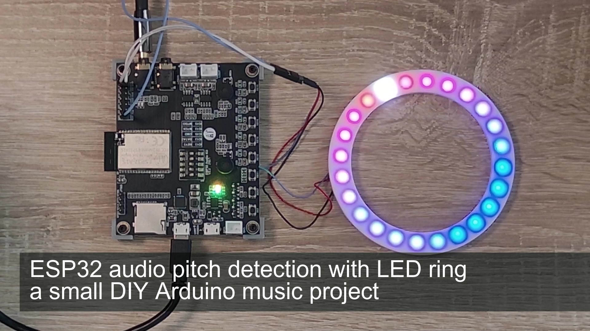

<h1 align="center">ml_pitch_detector</h1>
<h3 align="center"Arduino pitch detector - showing the measured pitch via LEDs (WS2812) of an audio signal</h3>  

 
   
  <a href="https://youtu.be/Ddy_T9LsH0A">link to the video ESP32</a>

The required library can be found here: 
- https://github.com/marcel-licence/ML_SynthTools
- https://github.com/marcel-licence/ML_SynthTools_Lib

This project was tested with the ESP32 audio kit
Please create a feature request if you need support for other platforms